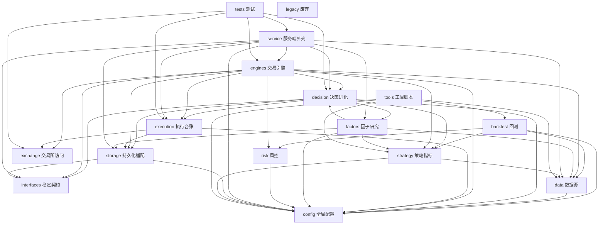

# 代码知识图谱（code knowledge graph）

> 轻量代码知识图谱：三层建模（模块 → 符号 → 数据流）+ 影响面查询。
> 由 `tools/code_graph.py` 静态分析（AST）自动生成，纯标准库，零新依赖。
> 生成/查询命令见文末；改代码后重跑 `--check`，发现分层违规立即修复。

## 一、三层模型

| 层 | 节点 | 边 | 本仓规模 |
|---|---|---|---|
| 1 模块层 | 包/模块 | import 依赖 | 215 模块、70 条跨层边 |
| 2 符号层 | 类/函数/方法 | 调用、self 调用、跨模块解析 | 1658 定义、16059 调用边（2834 已解析） |
| 3 数据流层 | 状态文件 | 读写（open/json.load/json.dump + 常量别名解析） | 16 条直接读写 + 205 个状态文件常量 |

## 二、层间依赖图（mermaid，模块层）



## 三、层间依赖矩阵（跨层，70 条边）

| 层 | 依赖 |
|---|---|
| service 服务端外壳 | config, data, decision, engines, execution, factors, interfaces, storage |
| engines 交易引擎 | config, data, decision, exchange, execution, interfaces, risk, storage, strategy |
| decision 决策进化 | config, execution, factors, interfaces, storage, strategy |
| execution 执行台账 | config, exchange, storage |
| storage 持久化适配 | config, interfaces |
| interfaces 稳定契约 | 无 |
| factors 因子研究 | config, data, decision, storage, strategy |
| tools 工具脚本 | backtest, config, data, decision, engines, exchange, factors, storage, strategy |
| data 数据源 | config |
| strategy 策略指标 | config, data |
| risk 风控 | config |
| backtest 回测 | config, data, risk, strategy |
| tests 测试 | config, data, decision, engines, exchange, execution, factors, interfaces, service, storage, strategy, tools |

## 四、符号层示例（影响面查询）

问"改 `open_position` 会波及谁"：

```
$ python3 tools/code_graph.py --query calls:open_position
  engines/directional_trader.py::DirectionalTrader.scan_signals  →  self.open_position  (→ engines/directional_trader.py)
  tests/test_exchange_layers.py::test_full_trade_flow  →  dt.open_position  (→ engines/directional_trader.py)
```

问"改 `trade_journal.json` 会波及谁"：

```
$ python3 tools/code_graph.py --query file:trade_journal.json
  定义/默认引用: ['execution/trade_journal.py']
  写方: []
  读方: []
```

（写/读方为空是因为 journal 通过 `self.path` 变量间接打开——常量别名解析只能覆盖字面量；
若需精确追踪变量流转，需升级到数据流分析，当前规模不值得。）

## 五、分层规则与检查

**显式层级序（自上而下，只许向下依赖）：**

```
service → engines → decision → execution → strategy/risk → storage/exchange/data → interfaces/config
```

- 底座豁免：`data`（数据源）、`config`（全局配置）允许被任何上层引用；
  `interfaces` 是无副作用的最底层稳定契约。
- 外围豁免：`tools` / `tests` / `factors` / `backtest` / `legacy` 可引用核心层。
- 接口守卫：服务层禁止直接 import `storage.db`，核心运行链禁止 import `tools.*`，
  跨功能包禁止 import 对方 `_private` 符号。
- 检查项（`--check`）：① 分层反向依赖 ② 接口绕过 ③ 跨层共享状态文件
  ④ import 环。
- 检查结果（2026-08-23）：**✅ 无违规**（selftest 覆盖分层和接口绕过的正/反例）。

## 六、命令速查

```bash
python3 tools/code_graph.py --check              # 全量检查：分层 + 共享状态 + import 环
python3 tools/code_graph.py --dump               # 人类可读汇总（层矩阵/符号/数据流统计）
python3 tools/code_graph.py --mermaid [模块]     # mermaid 图（默认模块层；给模块=符号层）
python3 tools/code_graph.py --json               # 完整图 JSON（知识图谱持久化/下游消费）
python3 tools/code_graph.py --query <模式>       # 影响面查询
#   file:<文件名>   谁读/写这个状态文件
#   calls:<符号名>  谁调用这个函数（改动影响面）
#   module:<模块>   模块的层/符号/状态文件常量/调用清单
#   layers          层间依赖矩阵
python3 tools/code_graph.py --selftest           # 内嵌自测（检查器抓合成违规）
```

## 七、已知边界（诚实声明）

- 调用解析是**静态尽力而为**：多义短名不强行归位（candidates 列出）、`self` 方法在本类内解析、
  动态属性调用（`*.fetch_balance`）标为未解析——不是类型精确的数据流分析。
- 数据流层只追踪**字面量路径**（含函数默认参数与常量别名）；变量间接传递（`self.path`）不追踪。
- 本工具定位是"AI 协作的影响面地图"，不是编译器级分析；重型语义图（Neo4j + GraphRAG）
  对当前仓库规模收益边际低，刻意不引入。
