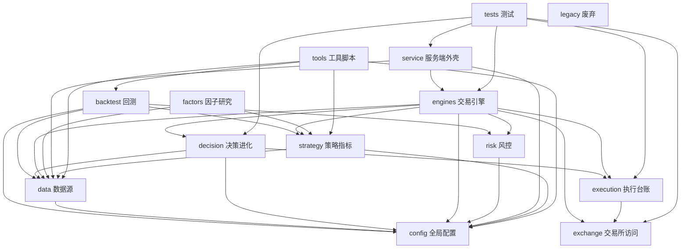

# 代码关系图（dependency graph）

> 由 `tools/dependency_graph.py` 静态分析（AST import）自动生成。
> 生成命令：`python3 tools/dependency_graph.py --check / --mermaid / --dump`
> 改代码后重跑 `--check`，发现分层违规立即修复。

## 一、层间依赖图（mermaid）



## 二、层间依赖矩阵（跨层，33 条边）

| 层 | 依赖 |
|---|---|
| service 服务端外壳 | config, data, engines |
| engines 交易引擎 | config, data, decision, exchange, execution, risk, strategy |
| decision 决策进化 | config, data, execution |
| execution 执行台账 | exchange |
| factors 因子研究 | data, strategy |
| tools 工具脚本 | backtest, config, data, strategy |
| data 数据源 | config |
| strategy 策略指标 | config, data |
| risk 风控 | config |
| backtest 回测 | config, data, risk, strategy |
| tests 测试 | decision, engines, exchange, execution, service |

## 三、分层规则与检查

**显式层级序（自上而下，只许向下依赖）：**

```
service → engines → decision → execution → strategy/risk → exchange → data → config
```

- 底座豁免：`data`（数据源）、`config`（全局配置）允许被任何上层引用。
- 外围豁免：`tools` / `tests` / `factors` / `backtest` / `legacy` 是研究/测试/工具，可引用核心层，不计入方向约束。
- 检查结果（2026-08-16）：`python3 tools/dependency_graph.py --check` → **✅ 无违规**。

## 四、模块规模

| 层 | 文件数 | 层 | 文件数 |
|---|---|---|---|
| data 数据源 | 15 | exchange 交易所访问 | 6 |
| backtest 回测 | 13 | tools 工具脚本 | 6 |
| tests 测试 | 8 | service 服务端外壳 | 5 |
| decision 决策进化 | 8 | execution 执行台账 | 4 |
| engines 交易引擎 | 6 | factors 因子研究 | 4 |

## 五、沉淀方式

- 本文件由脚本生成的内容（一、二、四节）以 `tools/dependency_graph.py --mermaid/--dump` 输出为准；
  手改结构后重跑脚本同步更新。
- `--check` 建议纳入 CI 或每次提交前手跑一次（当前无 CI，遵循单写者约定手跑）。
